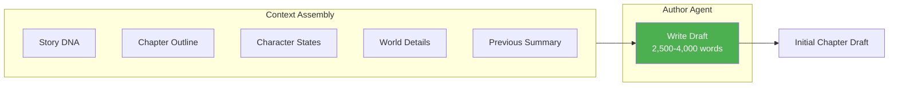
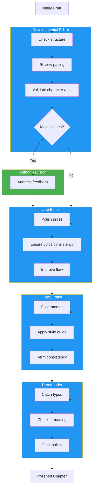
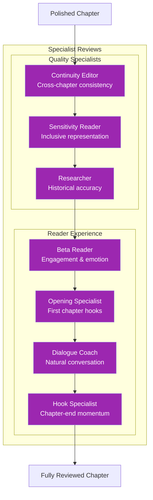
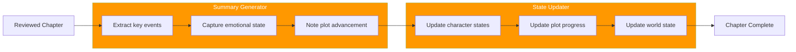
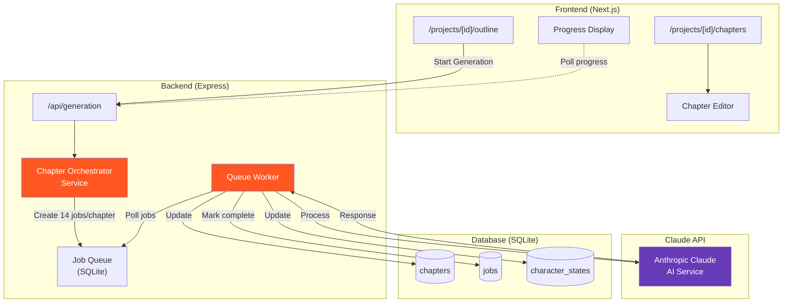
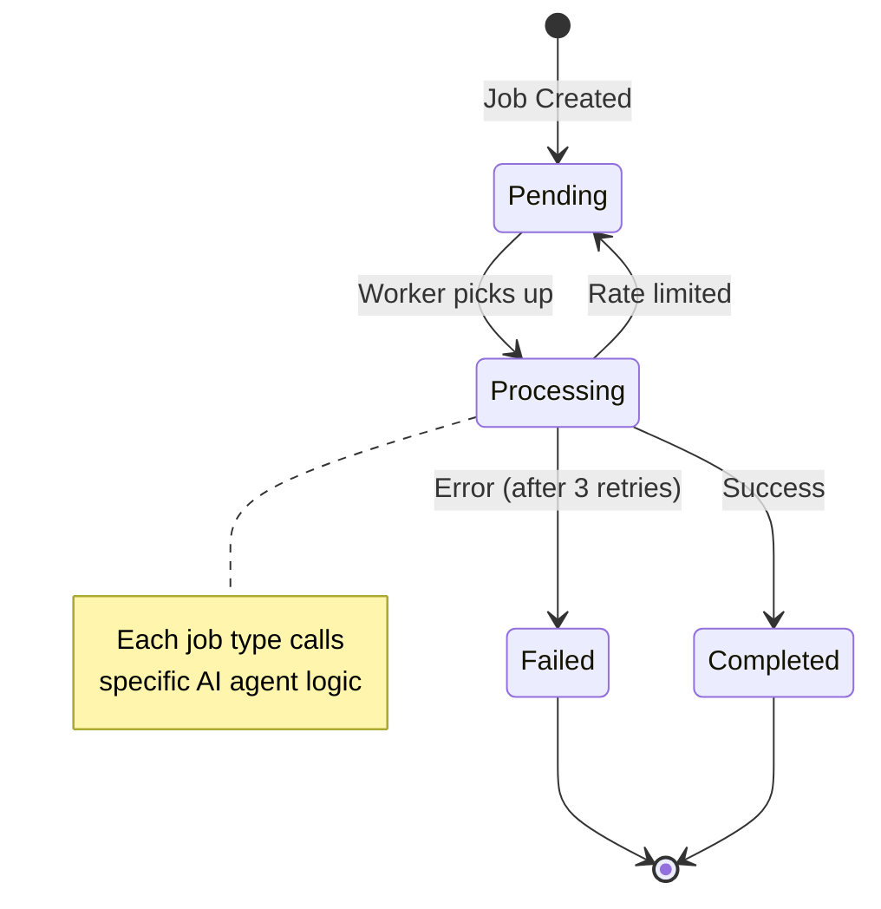

# Chapter Generation Workflow

This document visualises how AI agents collaborate to generate publication-quality chapters in NovelForge.

## High-Level Overview

```mermaid
flowchart TB
    subgraph User["User Interface"]
        UI[Outline Page]
        Progress[Progress Display]
        Editor[Chapter Editor]
    end

    subgraph Orchestration["Orchestration Layer"]
        CO[Chapter Orchestrator]
        QW[Queue Worker]
    end

    subgraph Agents["AI Agent Pipeline"]
        direction TB

        subgraph Creation["1. Creation Phase"]
            Author[Author Agent<br/>Writes initial draft]
        end

        subgraph Editorial["2. Editorial Phase"]
            DevEdit[Developmental Editor<br/>Structure & pacing]
            AuthorRev[Author Revision<br/>Address feedback]
            LineEdit[Line Editor<br/>Polish prose]
            CopyEdit[Copy Editor<br/>Grammar & style]
            Proofread[Proofreader<br/>Final quality]
        end

        subgraph Specialist["3. Specialist Phase"]
            Continuity[Continuity Editor<br/>Consistency check]
            Sensitivity[Sensitivity Reader<br/>Representation]
            Research[Researcher<br/>Facts & history]
            BetaReader[Beta Reader<br/>Reader engagement]
            Opening[Opening Specialist<br/>Chapter 1 hook]
            Dialogue[Dialogue Coach<br/>Natural speech]
            Hook[Hook Specialist<br/>Chapter endings]
        end

        subgraph Finalisation["4. Finalisation Phase"]
            Summary[Summary Generator<br/>Context for next chapter]
            States[State Updater<br/>Character arcs]
        end
    end

    UI -->|Start Generation| CO
    CO -->|Queue 14 jobs per chapter| QW
    QW -->|Process sequentially| Author
    Author --> DevEdit
    DevEdit -.->|If revision needed| AuthorRev
    AuthorRev -.-> LineEdit
    DevEdit --> LineEdit
    LineEdit --> CopyEdit
    CopyEdit --> Proofread
    Proofread --> Continuity
    Continuity --> Sensitivity
    Sensitivity --> Research
    Research --> BetaReader
    BetaReader --> Opening
    Opening --> Dialogue
    Dialogue --> Hook
    Hook --> Summary
    Summary --> States
    States -->|Chapter Complete| Progress
    Progress --> Editor

    style Author fill:#4CAF50,color:#fff
    style DevEdit fill:#2196F3,color:#fff
    style AuthorRev fill:#4CAF50,color:#fff
    style LineEdit fill:#2196F3,color:#fff
    style CopyEdit fill:#2196F3,color:#fff
    style Proofread fill:#2196F3,color:#fff
    style Continuity fill:#9C27B0,color:#fff
    style Sensitivity fill:#9C27B0,color:#fff
    style Research fill:#9C27B0,color:#fff
    style BetaReader fill:#9C27B0,color:#fff
    style Opening fill:#9C27B0,color:#fff
    style Dialogue fill:#9C27B0,color:#fff
    style Hook fill:#9C27B0,color:#fff
    style Summary fill:#FF9800,color:#fff
    style States fill:#FF9800,color:#fff
```

## Detailed Agent Responsibilities

### 1. Creation Phase (Green)

**Author Agent** receives:
- Story DNA (tone, themes, style)
- Chapter outline with scene cards
- Character states and arcs
- World-building details
- Previous chapter summary

**Output**: Initial draft (2,500-4,000 words)

---

### 2. Editorial Phase (Blue)

---

### 3. Specialist Phase (Purple)

| Specialist | Focus |
|------------|-------|
| **Continuity Editor** | Cross-chapter consistency, timeline, character details |
| **Sensitivity Reader** | Inclusive representation, avoiding harmful tropes |
| **Researcher** | Historical/factual accuracy, world consistency |
| **Beta Reader** | Reader engagement, emotional beats, pacing |
| **Opening Specialist** | First chapter hooks (Chapter 1 only) |
| **Dialogue Coach** | Natural conversation, character voice distinction |
| **Hook Specialist** | Chapter endings that compel continued reading |

---

### 4. Finalisation Phase (Orange)

**Summary Generator** creates:
- Key event summary for next chapter context
- Character emotional states
- Plot advancement notes

**State Updater** maintains:
- Character arc progression
- Relationship changes
- World state modifications

---

## Full Pipeline Timeline

```mermaid
gantt
    title Chapter Generation Pipeline
    dateFormat X
    axisFormat %s

    section Creation
    Author Agent           :a1, 0, 1

    section Editorial
    Developmental Editor   :a2, after a1, 1
    Author Revision        :a3, after a2, 1
    Line Editor           :a4, after a3, 1
    Copy Editor           :a5, after a4, 1
    Proofreader           :a6, after a5, 1

    section Specialist
    Continuity Editor     :a7, after a6, 1
    Sensitivity Reader    :a8, after a7, 1
    Researcher            :a9, after a8, 1
    Beta Reader           :a10, after a9, 1
    Opening Specialist    :a11, after a10, 1
    Dialogue Coach        :a12, after a11, 1
    Hook Specialist       :a13, after a12, 1

    section Finalisation
    Summary Generator     :a14, after a13, 1
    State Updater         :a15, after a14, 1
```

---

## System Architecture

---

## Job Processing Flow

---

## Legend

| Colour | Phase |
|--------|-------|
| Green | Creation (Author Agent) |
| Blue | Editorial (Editors) |
| Purple | Specialist (Quality reviewers) |
| Orange | Finalisation (Summary & state) |

---

## Related Files

- **Orchestrator**: `backend/src/services/chapter-orchestrator.service.ts`
- **Queue Worker**: `backend/src/queue/worker.ts`
- **Claude Service**: `backend/src/services/claude.service.ts`
- **Chapter Page**: `app/projects/[id]/chapters/page.tsx`
- **Editor Component**: `app/components/ChapterEditor.tsx`
